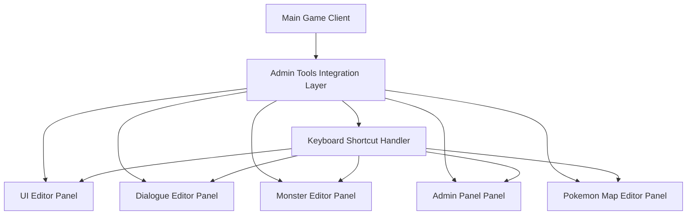
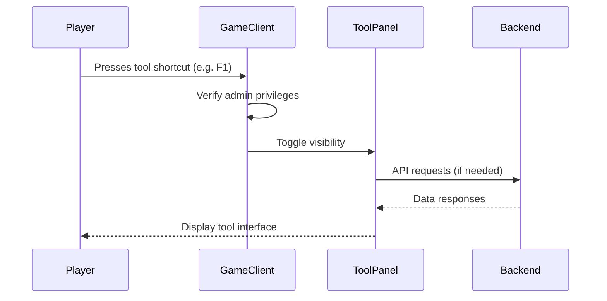

# Admin Tools Integration Design Document

## 1. Overview

This document outlines the design for integrating the development tools suite directly into the main game client for admin users. The integration will allow admins to access all development tools through dedicated keyboard shortcuts without requiring separate server instances. This approach will streamline the admin experience by providing in-game access to essential development and management tools.

### 1.1 Objectives

- Integrate all development tools (UI Editor, Dialogue Editor, Monster Editor, Admin Panel, Pokemon Map Editor) into the main game client
- Provide dedicated keyboard shortcuts (1, 2, 0) for each tool accessible only to admin users
- Eliminate the need for separate server instances for development tools
- Maintain security by restricting access to admin users only
- Ensure seamless integration with existing admin features

### 1.2 Current State

Currently, the development tools suite consists of four separate React applications:
1. UI Editor - Visual interface builder
2. Dialogue Editor - Node-based conversation editor
3. Monster Editor - Pokemon database management tool
4. Admin Panel - Server management dashboard

These tools currently run as separate applications on different ports and are not integrated into the main game client. Additionally, the Pokemon Map Editor runs as a separate server application that can be accessed via browser.

Admin users currently access these tools through:
- Opening new browser tabs to the tool URLs
- Running separate server instances for each tool
- Using the existing map editor shortcut (key '9') which opens in a new tab

## 2. Architecture

### 2.1 Integration Approach

The integration will embed the development tools directly into the main game client as iframe-based panels that can be toggled with keyboard shortcuts. This approach maintains the existing tool functionality while providing in-game access.



### 2.2 Component Structure

1. **Keyboard Shortcut Handler**: Listens for admin tool shortcuts and manages panel visibility
2. **Tool Panels**: iframe containers for each development tool
3. **Panel Manager**: Controls the display, positioning, and lifecycle of tool panels
4. **Authentication Integration**: Ensures only admin users can access the tools

### 2.3 Tool Panel Implementation

Each tool panel will be implemented as a resizable, draggable overlay with the following features:
- Close button to hide the panel
- Title bar showing the tool name
- Resizable edges for custom sizing
- Draggable title bar for positioning
- Loading indicator during iframe initialization
- Error handling for failed tool loading

The panels will be styled to match the game's UI aesthetic with a dark theme and appropriate transparency.

### 2.3 Data Flow



## 3. Keyboard Shortcut Design

### 3.1 Shortcut Mapping

| Key | Tool | Description |
|-----|------|-------------|
| 1 | UI Editor | Opens the UI component design tool |
| 2 | Map Editor | Opens the map editing tool |
| 0 | Admin Panel | Opens the server management dashboard |
| 6 | Battle Testing Help | Shows battle testing menu (existing) |
| 7 | Grass Encounter | Simulates grass encounter (existing) |
| 8 | AI Trainer Battle | Starts AI trainer battle (existing) |
| 9 | Random Battle | Starts random Pokemon battle (existing) |
| Esc | Close Active Tool | Closes the currently open tool panel |

### 3.2 Shortcut Implementation

Keyboard shortcuts will be implemented in the existing `PlayerController` class in `public/js/player.js`, extending the current admin shortcut handling logic.

### 3.3 Menu Interaction and Focus Management

To ensure that keyboard shortcuts for one menu don't interfere with another when multiple menus are accessible:

1. **Menu Focus System**: Only one tool panel can have focus at a time
2. **Input Capture**: When a tool panel is open, game movement controls will be disabled
3. **Shortcut Isolation**: Tool-specific shortcuts will only work when that tool is active
4. **Priority Hierarchy**: Battle testing shortcuts will maintain priority over development tool shortcuts

The implementation will:
- Disable game controls when any admin tool panel is open
- Enable game controls when all panels are closed
- Prevent conflicting shortcuts from triggering multiple actions
- Provide visual indicators for which panel currently has focus

## 4. Security Considerations

### 4.1 Access Control

- All tools will be restricted to admin users only
- Server-side authentication will validate requests from tools
- Role-based access control will be enforced for all tool operations

### 4.2 Implementation Security

- Tools will be served from the same origin to avoid CORS issues
- Authentication tokens will be passed to tools via secure means
- Input validation will be implemented for all tool interactions

### 4.3 Authentication Token Passing

To ensure secure access to backend APIs, authentication tokens will be passed to the embedded tools through:
1. URL parameters for initial loading (with proper encoding)
2. PostMessage API for dynamic token updates
3. Secure storage in the tool context
4. Token refresh mechanisms aligned with main game session

Each tool will be modified to accept and use the provided authentication token for all backend requests, maintaining the same security model as the main game client.

## 5. Implementation Plan

### 5.1 Phase 1: Infrastructure Setup

1. Create tool panel container components
2. Implement keyboard shortcut handler
3. Set up authentication integration
4. Configure routing for embedded tools
5. Integrate existing maps from pokemon-map-editor/assets/maps directory
6. Ensure all map files are properly served by the main server

### 5.1.1 Tool URLs and Routing

The development tools will be accessible through the following URLs:
- UI Editor: `/dev-tools/ui-editor/`
- Dialogue Editor: `/dev-tools/dialogue-editor/`
- Monster Editor: `/dev-tools/monster-editor/`
- Admin Panel: `/dev-tools/admin-panel/`
- Pokemon Map Editor: `/pokemon-map-editor/`

These URLs will be served by the main game server, eliminating the need for separate tool servers.

### 5.1.2 Map Integration

All existing maps in the `pokemon-map-editor/assets/maps` directory will be integrated and accessible through the main server. The directory contains maps for various locations including:
- Towns and cities (Drewfort, Fallarbor Town, Fortree City, Lavaridge Town, Pacifidlog Town, Slateport City, Sootopolis City)
- Caves and special locations (Granite Cave, Shoal Cave, Silph Co.)
- Routes and overworld areas (Route 105, Route 130, Soaring Overworld)
- Personal/custom maps (perso directory)

The server will be configured to serve all GLB files from the maps directory, ensuring they are accessible for both gameplay and map editing. Map files will be served from the path `/pokemon-map-editor/assets/maps/` to maintain compatibility with existing code.

### 5.2 Phase 2: Tool Integration

1. Integrate UI Editor as iframe panel
2. Integrate Dialogue Editor as iframe panel
3. Integrate Monster Editor as iframe panel
4. Integrate Admin Panel as iframe panel
5. Integrate Pokemon Map Editor as iframe panel

### 5.3 Phase 3: Testing and Refinement

1. Test keyboard shortcuts with different admin users
2. Validate security restrictions
3. Optimize performance and user experience
4. Document usage for admin users

## 6. Technical Considerations

### 6.1 Performance

- Tools will be loaded on-demand to minimize initial load time
- iframe sandboxing will isolate tool execution
- Memory management will handle panel lifecycle

### 6.2 Compatibility

- All tools will maintain their existing functionality
- Responsive design will ensure tools work in the game client
- Cross-browser compatibility will be preserved

### 6.3 Maintenance

- Tools will continue to be updated independently
- Integration layer will be designed for easy updates
- Backward compatibility will be maintained

### 6.4 Error Handling and Fallbacks

The integration will implement comprehensive error handling:
1. Failed tool loading will display user-friendly error messages
2. Network errors will trigger automatic retry mechanisms
3. Authentication failures will redirect to login
4. Fallback to separate tool servers if embedded version fails
5. Graceful degradation for tools with heavy resource requirements

In case of critical failures, admins will be able to access tools through their original URLs as a backup.

## 7. User Experience

### 7.1 Interface Design

- Tools will open in overlay panels with consistent styling
- Each panel will have a close button and title bar
- Resizing capabilities will be provided for usability
- Dark theme will match the game's aesthetic

### 7.2 Workflow Integration

- Tools will maintain their standalone functionality
- In-game context will be passed to relevant tools
- Changes made in tools will be reflected in the game environment

## 8. Integration with Existing Admin Features

### 8.1 Current Admin Shortcuts

The current admin system already implements several keyboard shortcuts in `public/js/player.js`:
- Key 0: Start random Pokemon battle for testing *(to be moved to battle testing menu)*
- Key 6: Show admin battle testing help
- Key 7: Trigger grass encounter simulation (admin only)
- Key 8: Start AI trainer battle for testing (admin only)
- Key 9: Open map editor in new tab (admin only) *(to be replaced with in-game panel)*

### 8.2 Enhancement Strategy

The new tool integration will:
1. Replace the current key 9 behavior with an in-game panel instead of a new tab
2. Maintain all existing battle testing shortcuts (0, 6, 7, 8)
3. Reassign development tool access to keys 1, 2, and 0 (UI Editor, Map Editor, Admin Panel respectively)
4. Ensure all shortcuts are only accessible to admin users
5. Implement menu focus system to prevent shortcut conflicts

### 8.3 Authentication Flow

1. Admin users will be authenticated through the existing JWT system
2. Role verification will occur before any tool panel is displayed
3. All tool requests will be validated against the user's role
4. Session management will follow existing patterns

## 9. Implementation Details

### 9.1 PlayerController Modifications

The `PlayerController` class in `public/js/player.js` will be modified to handle the new admin tool shortcuts. Based on the existing code structure, the following cases will be added to the `handleKeyDown` method:

```javascript
// In the switch statement for key handling
// (Existing battle testing shortcuts are already implemented)
case 'Digit1':
case '1':
    // Open UI Editor (admin only)
    if (this.isAdmin) {
        console.log('🎨 Opening UI Editor panel...');
        // Implementation to open UI Editor panel
    } else {
        console.log('🚫 Access denied: Admin privileges required for UI Editor');
    }
    if (event.preventDefault) event.preventDefault();
    break;
case 'Digit2':
case '2':
    // Open Map Editor (admin only)
    if (this.isAdmin) {
        console.log('🗺️ Opening Map Editor panel...');
        // Implementation to open Map Editor panel
    } else {
        console.log('🚫 Access denied: Admin privileges required for Map Editor');
    }
    if (event.preventDefault) event.preventDefault();
    break;
case 'Digit0':
case '0':
    // Open Admin Panel (admin only) - Replacing existing random battle shortcut
    if (this.isAdmin) {
        console.log('🔧 Opening Admin Panel...');
        // Implementation to open Admin Panel
    } else {
        console.log('🚫 Access denied: Admin privileges required for Admin Panel');
    }
    if (event.preventDefault) event.preventDefault();
    break;
```

Note: The existing `Digit0` case for random Pokemon battle will be moved to another key or accessed through the battle testing menu to accommodate the Admin Panel shortcut.

### 9.2 Menu Focus Management Implementation

The menu focus system will be implemented through:

1. A global state manager to track which panel is currently active
2. Disabling game movement controls when any panel is open
3. Event listeners to capture all keyboard input when a panel is active
4. Visual focus indicators on the active panel

## 10. Backward Compatibility

To ensure a smooth transition and maintain usability for existing admin users:

1. All existing battle testing shortcuts (6, 7, 8) will remain unchanged
2. The random battle shortcut (0) will be moved to the battle testing menu but remain accessible
3. The map editor shortcut (9) will be updated to open an in-game panel instead of a new tab
4. Fallback mechanisms will be implemented to allow access to tools through their original URLs
5. Documentation will be updated to reflect the new key mappings

## 11. Battle Engine Integration

The poke-battle directory contains the pokengine battle system that is already integrated into the game through the BattleModule class. This integration ensures that:

1. The battle system runs within the existing Babylon.js MMO without taking over the entire page
2. The battle system uses the existing Socket.io connection for networking
3. Battle events are properly communicated between the battle system and the main game
4. The battle system maintains its own UI while integrating with the game's visual style

The BattleModule provides a clean interface to the pokengine battle system and handles all necessary setup, including:
- Loading pokengine CSS and JavaScript files
- Initializing the battle interface
- Managing battle state transitions
- Emitting events for battle start, end, and updates

All existing battle testing functionality (keys 0, 6, 7, 8, 9) will continue to work with the integrated pokengine system.

## 12. Conclusion

This integration design provides a comprehensive solution for embedding development tools directly into the game client while maintaining security and usability. By using the existing keyboard shortcut infrastructure and implementing a focus management system, admin users will have seamless access to all necessary tools without conflicts. The design preserves all existing battle testing functionality while adding convenient access to development tools through intuitive key mappings. The integration also ensures that all existing maps are accessible and the pokengine battle system is properly integrated.