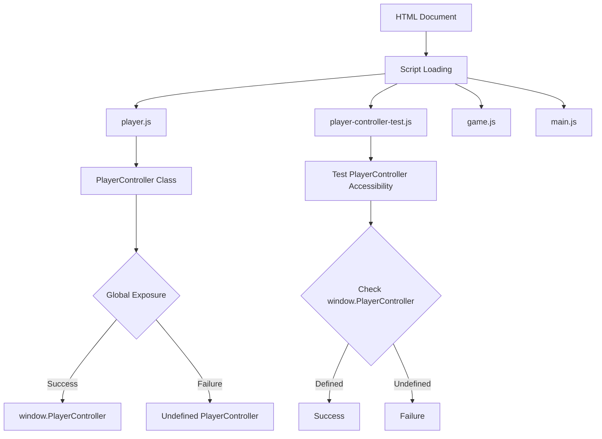
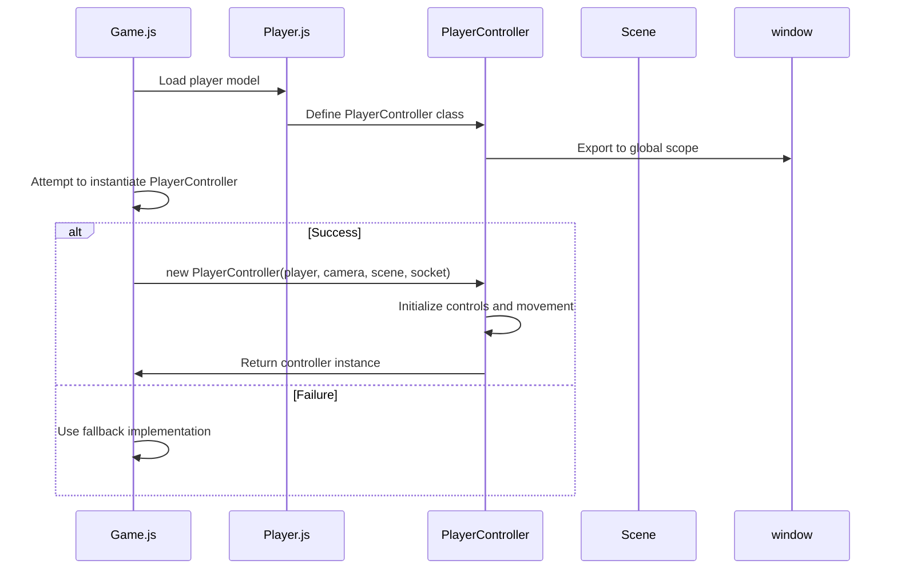

# Debugging PlayerController Issues in Pokemon MMO

## Overview

This document outlines the debugging process for PlayerController accessibility issues in the Pokemon MMO - Omega Ruby Style project. The error logs indicate that the PlayerController is not accessible globally, which is causing game initialization failures.

## Problem Analysis

### Error Symptoms
1. `player.js:1224 Uncaught` error in console
2. PlayerController is NOT accessible globally
3. PlayerController is NOT defined as a function/class
4. Game initialization error during player creation
5. Physics not enabled warnings
6. Player model loading failures

### Root Cause Investigation

Based on the error logs and code analysis:

1. **Script Loading Order**: The `player-controller-test.js` is loaded immediately after `player.js` in the HTML, but there might be an issue with how the PlayerController class is being exported or a syntax error preventing proper parsing.

2. **Global Scope Exposure**: Although the code attempts to expose PlayerController to the global scope with `window.PlayerController = PlayerController;`, there might be an issue with this assignment.

3. **Syntax Errors**: There could be a syntax error in player.js that prevents the entire file from being parsed correctly.

4. **Asynchronous Loading Issues**: The PlayerController might be referenced before it's fully defined due to asynchronous operations.

## Architecture

### Component Structure


### PlayerController Dependencies
- Babylon.js engine
- Socket.io connection
- Game scene
- Player mesh
- Camera system

## Debugging Steps

### 1. Verify Script Loading Order
Check that scripts are loaded in the correct order in `index.html`:
```html
<script src="js/player.js"></script>
<script src="js/player-controller-test.js"></script>
<script src="js/game.js"></script>
<script src="js/main.js"></script>
```

### 2. Check PlayerController Export
Verify that the PlayerController class is properly exported in `player.js`:
```javascript
// At the end of player.js
if (typeof module !== 'undefined' && module.exports) {
    module.exports = PlayerController;
}

// Expose to global scope for direct access
window.PlayerController = PlayerController;
```

### 3. Validate Syntax
Check for syntax errors in player.js that might prevent parsing:
- Missing brackets or semicolons
- Incorrect method declarations
- Invalid character sequences

### 4. Add Debugging Information
Add console logs to verify when PlayerController is defined:
```javascript
console.log('PlayerController class definition complete');
window.PlayerController = PlayerController;
console.log('PlayerController assigned to window:', typeof window.PlayerController);
```

## Solutions

### Solution 1: Fix Script Loading Issues

1. **Ensure proper script loading order**:
   ```
   auth.js → chat.js → battle components → player.js → game.js → main.js
   ```

2. **Add error handling for script loading**:
   ```javascript
   // In index.html, add error handlers
   <script src="js/player.js" onload="console.log('Player.js loaded')" onerror="console.error('Failed to load player.js')"></script>
   ```

### Solution 2: Improve Global Exposure

Modify the export section in `player.js` to be more robust:

```javascript
// Enhanced export at the end of player.js
(function(global) {
    'use strict';
    
    // CommonJS export
    if (typeof module !== 'undefined' && module.exports) {
        module.exports = PlayerController;
    }
    
    // AMD export
    if (typeof define === 'function' && define.amd) {
        define(function() {
            return PlayerController;
        });
    }
    
    // Global export
    global.PlayerController = PlayerController;
    
    console.log('PlayerController exported successfully, type:', typeof global.PlayerController);
})(typeof window !== 'undefined' ? window : typeof global !== 'undefined' ? global : typeof self !== 'undefined' ? self : this);
```

### Solution 3: Add Defensive Programming

Add checks in `player-controller-test.js` to provide more detailed error information:

```javascript
// Enhanced player-controller-test.js
console.log('Testing PlayerController accessibility...');

// Check if window object exists
if (typeof window === 'undefined') {
    console.error('❌ Window object not available');
} else {
    console.log('✅ Window object available');
    
    // Check if PlayerController is defined in global scope
    if (typeof window.PlayerController !== 'undefined') {
        console.log('✅ PlayerController is accessible globally');
    } else {
        console.error('❌ PlayerController is NOT accessible globally');
        console.log('Current window properties:', Object.keys(window).filter(key => key.includes('Player')));
    }

    // Check if PlayerController is defined as a class/function
    if (typeof window.PlayerController === 'function') {
        console.log('✅ PlayerController is defined as a function/class');
        try {
            // Try to instantiate
            const testInstance = new window.PlayerController();
            console.log('✅ PlayerController can be instantiated');
        } catch (e) {
            console.error('❌ PlayerController instantiation failed:', e.message);
        }
    } else {
        console.error('❌ PlayerController is NOT defined as a function/class');
        console.log('PlayerController type:', typeof window.PlayerController);
        console.log('PlayerController value:', window.PlayerController);
    }
}
```

### Solution 4: Implement Fallback Mechanism

Add a fallback mechanism in `game.js` to handle cases where PlayerController is not available:

```javascript
// In game.js where PlayerController is instantiated
try {
    if (typeof PlayerController === 'undefined' && typeof window.PlayerController !== 'undefined') {
        PlayerController = window.PlayerController;
        console.log('🔧 Using PlayerController from window object');
    }
    
    if (typeof PlayerController === 'undefined') {
        throw new Error('PlayerController is not defined');
    }
    
    const userRole = this.user?.role || 'user';
    this.playerController = new PlayerController(this.player, this.camera, this.scene, this.socket, userRole);
    console.log('✅ PlayerController instantiated successfully');
} catch (error) {
    console.error('❌ Failed to instantiate PlayerController:', error);
    
    // Fallback implementation
    this.playerController = {
        player: this.player,
        camera: this.camera,
        scene: this.scene,
        socket: this.socket,
        updateCamera: function() {},
        getPlayerState: function() { 
            return { position: this.player.position, rotation: this.player.rotation }; 
        },
        // Add other required methods with minimal implementation
    };
    
    console.log('⚠️ Using fallback PlayerController implementation');
}
```

## API Endpoints Reference

No API changes required for this debugging task.

## Data Models

No data model changes required for this debugging task.

## Business Logic Layer

### PlayerController Initialization Flow


## Middleware & Interceptors

No middleware changes required for this debugging task.

## Testing

### Unit Tests

1. **PlayerController Accessibility Test**:
   - Verify PlayerController is accessible in global scope
   - Confirm PlayerController is a function/class
   - Test instantiation with mock dependencies

2. **Script Loading Test**:
   - Verify all required scripts load in correct order
   - Check for syntax errors in player.js
   - Confirm exports work correctly

3. **Fallback Mechanism Test**:
   - Test game initialization when PlayerController fails
   - Verify fallback implementation provides basic functionality
   - Confirm error handling works properly

### Integration Tests

1. **Full Game Initialization Test**:
   - Load game with valid session
   - Verify player model loads correctly
   - Confirm PlayerController initializes without errors
   - Test basic movement controls

2. **Error Recovery Test**:
   - Simulate PlayerController loading failure
   - Verify fallback mechanism activates
   - Confirm game remains playable with limited functionality

## Implementation Recommendations

### Immediate Fixes

1. **Add Enhanced Error Logging**:
   - Add detailed console logs in player.js export section
   - Improve error messages in player-controller-test.js
   - Add try/catch blocks around critical instantiation code

2. **Fix Export Mechanism**:
   - Implement robust export pattern in player.js
   - Add verification that export was successful
   - Provide fallback if standard export fails

3. **Improve Error Handling**:
   - Add fallback PlayerController implementation
   - Implement graceful degradation when physics aren't available
   - Add better error messages for debugging

### Long-term Improvements

1. **Module System**:
   - Consider migrating to ES6 modules for better dependency management
   - Implement proper import/export system
   - Reduce reliance on global scope

2. **Build Process**:
   - Add linting to catch syntax errors before runtime
   - Implement bundling to ensure proper load order
   - Add minification for production builds

3. **Error Monitoring**:
   - Add centralized error handling
   - Implement error reporting system
   - Add user-friendly error notifications

## Conclusion

The PlayerController accessibility issue is likely caused by either a syntax error preventing proper parsing of player.js or a problem with the global scope export mechanism. By implementing the debugging steps and solutions outlined above, we should be able to identify and resolve the root cause of the issue. The enhanced error handling and fallback mechanisms will also improve the robustness of the game initialization process.