# Pokemon MMO - Game Structure Improvement Design

## Overview

This design document outlines a comprehensive restructuring and improvement plan for the Pokemon MMO Omega Ruby-style project. The goal is to transform the existing codebase into a professional, maintainable, and scalable game architecture with clean separation of concerns, modern tooling, and robust editor integration.

### Current State Analysis

The project currently exists as a functional Pokemon MMO with:
- **Client-side**: Browser-based 3D game using Babylon.js
- **Server-side**: Node.js with Express and Socket.io for real-time communication
- **Database**: PostgreSQL for persistent data storage
- **Editors**: Standalone map editor and development tools in `dev-tools/`
- **Battle System**: Integrated Pokemon battle mechanics
- **Chat System**: Real-time communication with role-based commands

### Target Architecture Vision

Transform the project into a modular, professional-grade MMO with:
- Clean architectural separation between client, server, and database layers
- Integrated development tools accessible via keyboard shortcuts
- Unified UI/UX design system
- Optimized performance and scalability
- Comprehensive testing and documentation

## Architecture Redesign

### Client-Side Architecture

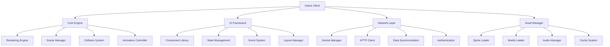

#### Proposed Directory Structure
```
client/
├── core/
│   ├── engine/          # Babylon.js integration and rendering
│   ├── scene/           # Scene management and camera control
│   ├── collision/       # Physics and collision detection
│   └── animation/       # Character and object animations
├── ui/
│   ├── components/      # Reusable UI components
│   ├── layouts/         # Screen layouts and containers
│   ├── themes/          # Design system and styling
│   └── state/           # UI state management
├── network/
│   ├── socket/          # WebSocket communication
│   ├── http/            # REST API client
│   ├── sync/            # Data synchronization logic
│   └── auth/            # Authentication handling
├── gameplay/
│   ├── battle/          # Battle system logic
│   ├── inventory/       # Item and Pokemon management
│   ├── quests/          # Quest and dialogue system
│   └── world/           # World interaction and exploration
└── assets/
    ├── sprites/         # 2D graphics and animations
    ├── models/          # 3D models and textures
    ├── audio/           # Sound effects and music
    └── data/            # Game data and configurations
```

### Server-Side Architecture

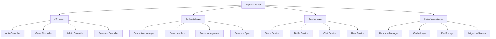

#### Proposed Directory Structure
```
server/
├── controllers/
│   ├── auth/            # Authentication endpoints
│   ├── game/            # Game state management
│   ├── admin/           # Administrative functions
│   └── pokemon/         # Pokemon data and battle logic
├── services/
│   ├── game/            # Core game logic
│   ├── battle/          # Battle system
│   ├── chat/            # Communication system
│   ├── user/            # User management
│   └── world/           # World state management
├── middleware/
│   ├── auth/            # Authentication middleware
│   ├── validation/      # Input validation
│   ├── logging/         # Request logging
│   └── security/        # Security headers and rate limiting
├── database/
│   ├── models/          # Database models
│   ├── migrations/      # Schema migrations
│   ├── seeders/         # Test data
│   └── queries/         # Optimized queries
├── sockets/
│   ├── handlers/        # Socket event handlers
│   ├── rooms/           # Room management
│   ├── middleware/      # Socket middleware
│   └── events/          # Event definitions
└── utils/
    ├── validators/      # Data validation utilities
    ├── helpers/         # Common helper functions
    ├── constants/       # Application constants
    └── config/          # Configuration management
```

### Database Architecture

#### Enhanced Schema Design

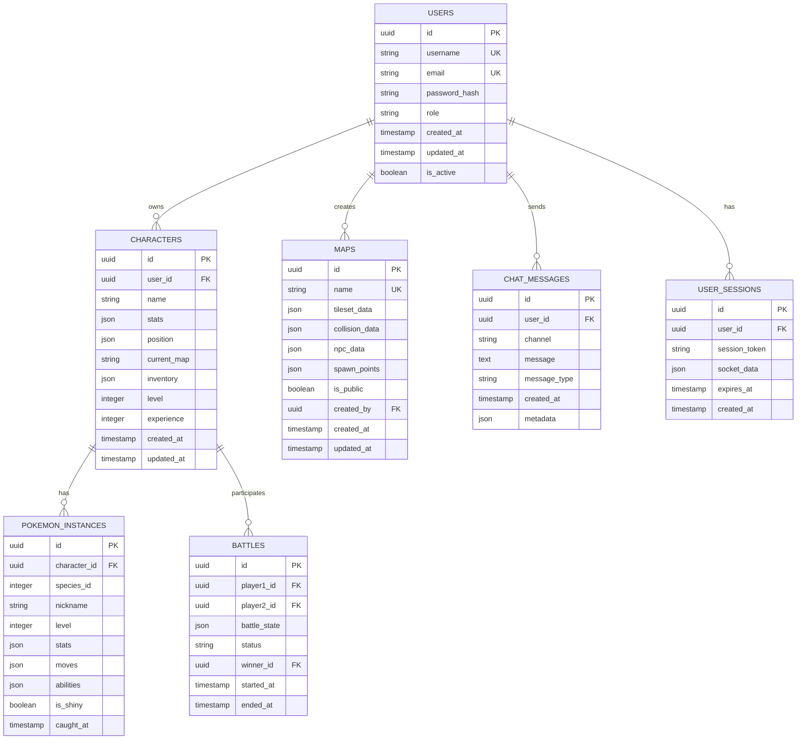

### Editor Integration Architecture

#### Unified Editor Framework

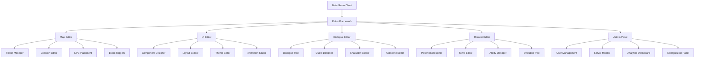

## Component Architecture

### Core Engine Components

#### Rendering Pipeline
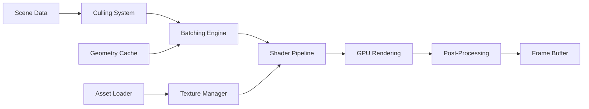

#### State Management
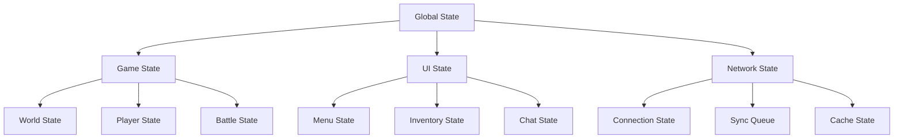

### UI Component System

#### Component Hierarchy
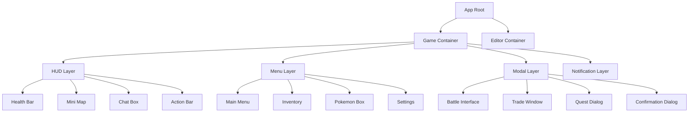

### Network Architecture

#### Communication Patterns
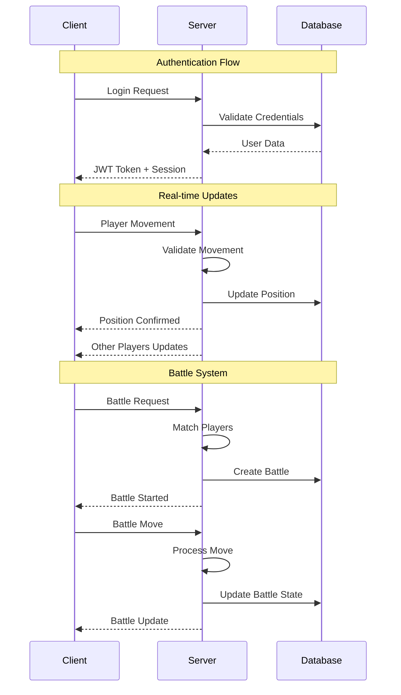

## Development Workflow

### Code Organization Standards

#### File Naming Conventions
- **Components**: PascalCase (e.g., `PlayerInventory.js`)
- **Services**: PascalCase with suffix (e.g., `GameService.js`)
- **Utilities**: camelCase (e.g., `dataValidation.js`)
- **Constants**: UPPER_SNAKE_CASE (e.g., `GAME_CONSTANTS.js`)

#### Module Structure Template
```javascript
// Standard module template
export class ComponentName {
  constructor(dependencies) {
    this.validateDependencies(dependencies);
    this.initializeComponent();
  }

  // Public API methods
  publicMethod() {
    // Implementation
  }

  // Private methods (prefix with _)
  _privateMethod() {
    // Implementation
  }

  // Cleanup and disposal
  dispose() {
    // Cleanup logic
  }
}
```

### Testing Strategy

#### Test Architecture
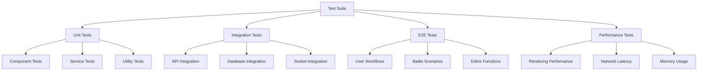

## Implementation Phases

### Phase 1: Foundation Restructuring
- **Objective**: Establish clean architecture and separation of concerns
- **Timeline**: 2-3 weeks
- **Deliverables**:
  - Refactored client-side module structure
  - Reorganized server-side services and controllers
  - Enhanced database schema with proper indexing
  - Basic test framework setup

### Phase 2: UI/UX Enhancement
- **Objective**: Create unified design system and improve user experience
- **Timeline**: 2-3 weeks
- **Deliverables**:
  - Component library with consistent styling
  - Responsive design implementation
  - Improved navigation and menu systems
  - Accessibility compliance

### Phase 3: Editor Integration
- **Objective**: Integrate all development tools into the main application
- **Timeline**: 3-4 weeks
- **Deliverables**:
  - Unified editor framework
  - Keyboard shortcut access system
  - Role-based editor permissions
  - Real-time collaboration features

### Phase 4: Performance Optimization
- **Objective**: Optimize rendering, networking, and database performance
- **Timeline**: 2-3 weeks
- **Deliverables**:
  - Optimized rendering pipeline
  - Efficient asset loading and caching
  - Database query optimization
  - Network latency reduction

### Phase 5: Testing and Documentation
- **Objective**: Comprehensive testing coverage and documentation
- **Timeline**: 2 weeks
- **Deliverables**:
  - Complete test suite
  - Performance benchmarks
  - Developer documentation
  - User guides

## Technical Specifications

### Performance Requirements

#### Client-Side Performance
- **Target FPS**: 60 FPS on modern browsers
- **Memory Usage**: < 512MB RAM for base game
- **Load Time**: < 5 seconds initial load
- **Network Latency**: < 100ms response time

#### Server-Side Performance
- **Concurrent Users**: Support 1000+ simultaneous players
- **Database Queries**: < 50ms average response time
- **Memory Usage**: Efficient memory management with garbage collection
- **CPU Usage**: < 80% under normal load

### Security Requirements

#### Authentication and Authorization
- JWT-based stateless authentication
- Role-based access control (Admin, Co-Admin, Helper, User)
- Rate limiting for API endpoints
- Input validation and sanitization

#### Data Protection
- Encrypted password storage using bcrypt
- Secure database connections
- Protection against SQL injection
- XSS and CSRF protection

### Scalability Considerations

#### Horizontal Scaling
- Stateless server architecture for load balancing
- Redis integration for session management
- Database read replicas for improved performance
- CDN integration for static assets

#### Monitoring and Analytics
- Real-time performance monitoring
- Error tracking and logging
- User analytics and behavior tracking
- Automated alerting for critical issues

## Pokemon Battle System Architecture

### Battle Engine Core

#### Battle Flow Management
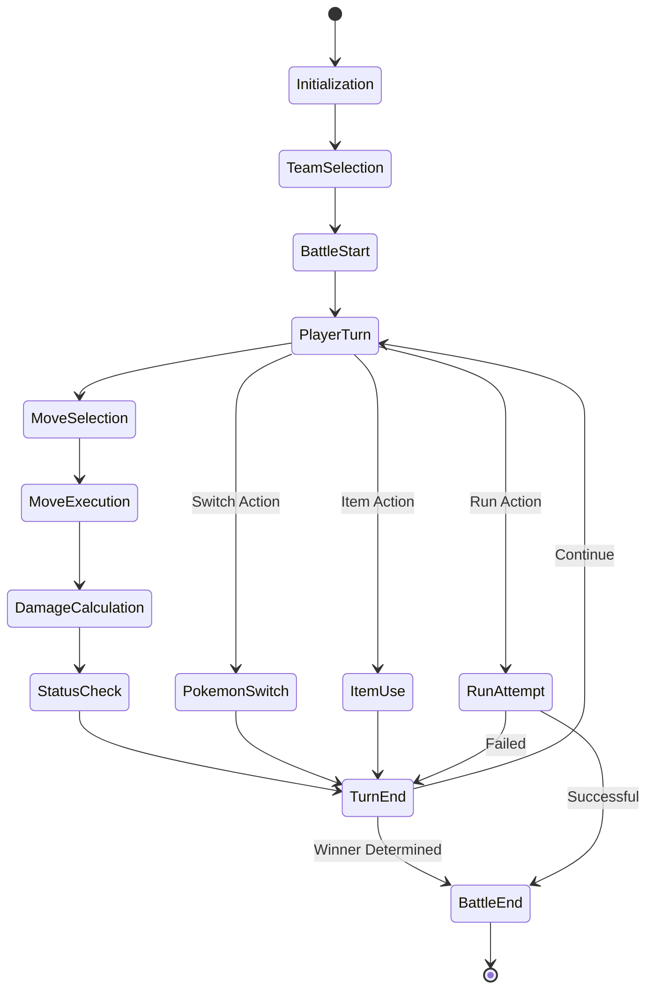

#### Battle System Components
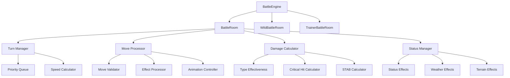

### Battle Types and Modes

#### PvP Battle System
- **Real-time Multiplayer**: Socket.io-based real-time battle communication
- **Turn-based Combat**: Traditional Pokemon turn-based mechanics
- **Ranked Matches**: ELO-based ranking system
- **Casual Battles**: Non-ranked practice matches
- **Tournament Mode**: Bracket-style competitions

#### Wild Pokemon Encounters
- **Random Encounters**: Map-based encounter system
- **Scripted Encounters**: Event-triggered battles
- **Legendary Battles**: Special boss-style encounters
- **Roaming Pokemon**: Dynamic encounter system

#### Battle Formats
- **Singles**: 1v1 Pokemon battles
- **Doubles**: 2v2 team battles
- **Multi-battles**: 2v2 with partner trainers
- **Sky Battles**: Flying-type exclusive format

### Battle UI Components

#### Battle Interface Layout
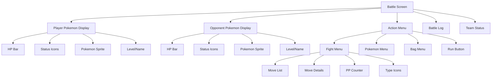

#### Move Selection Interface
- **Move Grid**: 2x2 grid layout for move selection
- **Type Indicators**: Color-coded move types
- **PP Display**: Remaining power points for each move
- **Effectiveness Preview**: Type matchup indicators
- **Status Effects**: Visual indicators for move effects

#### Pokemon Status Display
- **Health Bar**: Animated HP changes with color transitions
- **Experience Bar**: XP gain visualization
- **Status Conditions**: Icon-based status effect display
- **Stat Changes**: Visual indicators for stat modifications

### Battle Animation System

#### Animation Pipeline
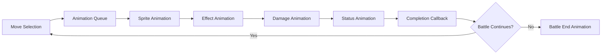

#### Animation Types
- **Move Animations**: Attack and special move effects
- **Status Animations**: Status condition visual effects
- **Entry/Exit Animations**: Pokemon appearing/fainting
- **Weather Animations**: Environmental effect overlays
- **UI Animations**: Menu transitions and feedback

## Advanced Editor Integration

### Unified Editor Framework

#### Editor Architecture
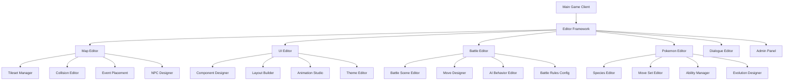

### Battle Editor Specifications

#### Move Designer
- **Move Properties**: Damage, accuracy, PP, type configuration
- **Effect System**: Custom move effect scripting
- **Animation Builder**: Visual effect creation tools
- **Sound Integration**: Audio effect assignment
- **Testing Environment**: Move testing sandbox

#### AI Behavior Editor
- **Decision Trees**: Visual AI logic construction
- **Difficulty Scaling**: Dynamic AI adaptation
- **Pattern Recognition**: Player behavior analysis
- **Strategy Templates**: Pre-built AI personalities

#### Battle Scene Designer
- **Environment Editor**: Battle background creation
- **Weather Effects**: Dynamic weather system setup
- **Terrain Features**: Battle field modification tools
- **Lighting System**: Dynamic lighting configuration

### UI/UX Design System

#### Component Library Architecture
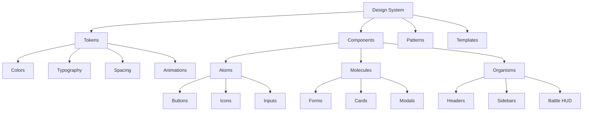

#### Pokemon-Themed UI Elements
- **Pokeball Buttons**: Animated interaction buttons
- **Type-based Color Schemes**: 18 Pokemon type color palettes
- **Badge System**: Achievement and progress indicators
- **HP Bar Animations**: Smooth health change transitions
- **Status Effect Icons**: Recognizable condition indicators

#### Responsive Design Framework
- **Grid System**: Flexible layout grid for all screen sizes
- **Breakpoint Management**: Device-specific layout optimization
- **Touch Interface**: Mobile-optimized touch controls
- **Accessibility**: WCAG 2.1 AA compliance

### Editor Integration Standards

#### Keyboard Shortcut System
- **Key '9'**: UI Editor access (Admin/Co-Admin)
- **Key '0'**: Map Editor access (Admin/Co-Admin)
- **Ctrl+E**: Battle Editor (Admin only)
- **Ctrl+P**: Pokemon Editor (Admin only)
- **F12**: Developer Console (Debug mode)

#### Role-based Editor Access
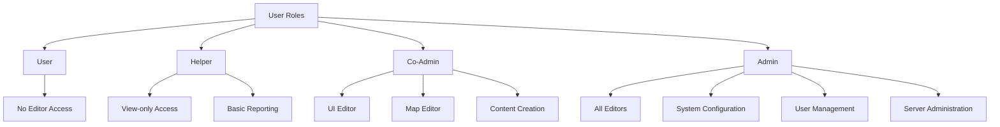

## Quality Assurance

### Code Quality Standards
- ESLint configuration for consistent code style
- Prettier for automated code formatting
- Husky pre-commit hooks for quality checks
- JSDoc documentation for all public APIs

### Review Process
- Pull request reviews for all code changes
- Automated testing pipeline
- Code coverage reporting
- Performance regression testing