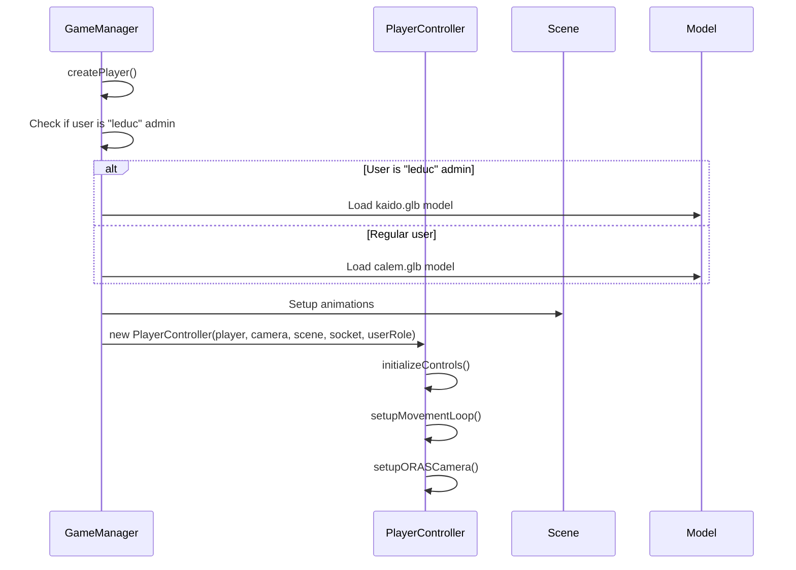

# Player Controller Implementation Design

## Overview

This document outlines the design for implementing the PlayerController class to ensure only admin user "leduc" can use the Kaido model while other users use the standard Calem model. The implementation will address the current ReferenceError where PlayerController is not defined.

## Architecture

### Current Implementation Issues

1. **Scope Issue**: The PlayerController class is defined in `player.js` but is not accessible in the global scope when `game.js` tries to instantiate it
2. **Module Export**: The PlayerController is exported using CommonJS (`module.exports`) but the project uses script tags for loading
3. **Model Loading**: The special Kaido model for admin "leduc" is correctly implemented but fails due to the PlayerController instantiation error

### Solution Architecture

```mermaid
graph TD
    A[GameManager] --> B[createPlayer Method]
    B --> C{Is User "leduc" Admin?}
    C -->|Yes| D[Load Kaido Model]
    C -->|No| E[Load Standard Calem Model]
    D --> F[Instantiate PlayerController]
    E --> F
    F --> G[Player Movement & Animation Control]
```

## Component Design

### PlayerController Class

The PlayerController class will manage player movement, animations, and controls with the following features:

#### Properties
- `player`: Reference to the player mesh
- `camera`: Reference to the game camera
- `scene`: Reference to the Babylon.js scene
- `socket`: Reference to the Socket.IO connection
- `userRole`: User's role (admin, co-admin, user)
- `isAdmin`: Boolean flag for admin privileges
- `moveSpeed`: Player movement speed
- `isMoving`: Movement state flag

#### Methods
- `constructor(playerMesh, camera, scene, socket, userRole)`: Initialize controller
- `initializeControls()`: Setup keyboard event listeners
- `setupORASCamera()`: Configure Pokemon ORAS-style camera
- `handleKeyDown(event)`: Handle key press events
- `handleKeyUp(event)`: Handle key release events
- `updateMovement()`: Update player position based on input
- `updateAnimationState()`: Manage player animations
- `teleportTo(position, rotation)`: Teleport player to position
- `getPlayerState()`: Get current player state
- `openAdminToolPanel(toolName, toolPath)`: Open admin tools for admins

### Special Model Loading for Admin "leduc"

The system will load a special Kaido model for admin user "leduc":

```javascript
// In createPlayer method
let modelFileName = 'calem/calem.glb';
if (this.user?.username === 'leduc' && (this.user?.role === 'admin' || this.user?.role === 'co-admin')) {
    modelFileName = 'calem/leduc/kaido.glb';
    console.log('👑 Chargement du modèle spécial Kaido pour l\'administrateur leduc');
}
```

## API Endpoints

No new API endpoints are required for this implementation.

## Data Models

No new data models are required for this implementation.

## Business Logic

### Player Controller Initialization Flow



### Admin-Specific Features

The PlayerController will provide admin-specific features that are only accessible to users with admin or co-admin roles:

1. **Admin Tool Shortcuts**:
   - UI Editor (1 key)
   - Map Editor (2 key)
   - Admin Panel (0 key)
   - Monster Editor (M key)
   - Dialogue Editor (L key)

2. **Battle Testing Tools**:
   - Random Pokemon battles (5 key)
   - Grass encounter simulation (7 key)
   - AI trainer battles (8 key)

## Middleware & Interceptors

No new middleware is required for this implementation.

## Testing Strategy

### Unit Tests

1. **PlayerController Instantiation Test**
   - Verify PlayerController can be instantiated without errors
   - Test with different user roles (admin, co-admin, user)

2. **Model Loading Test**
   - Verify standard model loads for regular users
   - Verify Kaido model loads for admin "leduc"

3. **Movement Control Test**
   - Test WASD/arrow key movement
   - Test running with shift key
   - Test admin-specific movement precision

4. **Animation Test**
   - Verify idle animation plays when stationary
   - Verify walk animation plays when moving
   - Verify run animation plays when running

### Integration Tests

1. **Admin Feature Access Test**
   - Verify admin tools are accessible to admin users
   - Verify admin tools are blocked for regular users

2. **Battle System Integration Test**
   - Test battle initiation for admin users
   - Verify battle system works with PlayerController

## Implementation Plan

### Phase 1: Fix PlayerController Scope Issue

1. Modify `player.js` to properly expose PlayerController to global scope by adding `window.PlayerController = PlayerController;`
2. Ensure PlayerController is accessible when `game.js` instantiates it
3. Test instantiation without errors

### Phase 2: Verify Model Loading

1. Confirm standard Calem model loads for regular users
2. Confirm Kaido model loads for admin "leduc"
3. Test fallback model creation on error

### Phase 3: Test Admin Features

1. Verify admin tool shortcuts work for admin users
2. Confirm admin features are blocked for regular users
3. Test battle testing tools for admins

## Security Considerations

1. **Role Verification**: All admin features will be verified server-side to prevent client-side manipulation
2. **Model Access**: The special Kaido model is only visually different and doesn't provide gameplay advantages
3. **Input Validation**: All keyboard inputs will be validated to prevent injection attacks

## Performance Considerations

1. **Animation Optimization**: Only active animations will have weight applied to save resources
2. **Movement Updates**: Position updates will only be sent when position changes significantly
3. **Event Listener Management**: Keyboard event listeners will be properly managed to prevent memory leaks

## Deployment Considerations

1. **File Structure**: Ensure `calem/leduc/kaido.glb` exists in the assets directory
2. **Script Loading Order**: Verify `player.js` is loaded before `game.js`
3. **Error Handling**: Implement proper fallbacks for model loading failures

## Code Changes Required

### Fix PlayerController Scope Issue

To fix the ReferenceError where PlayerController is not defined, we need to modify the `public/js/player.js` file to expose the PlayerController class to the global scope.

Add the following code at the end of the file, after the existing module export:

```javascript
// Export for use in other modules
if (typeof module !== 'undefined' && module.exports) {
    module.exports = PlayerController;
}

// Expose to global scope for direct access
window.PlayerController = PlayerController;
```

This change will make the PlayerController class available in the global scope, allowing the game.js file to instantiate it without errors.

### Verify Model Loading Logic

The model loading logic for admin "leduc" is already correctly implemented in the `createPlayer` method in `game.js`:

```javascript
// Use specific model for admin "leduc"
let modelFileName = 'calem/calem.glb';
if (this.user?.username === 'leduc' && (this.user?.role === 'admin' || this.user?.role === 'co-admin')) {
    modelFileName = 'calem/leduc/kaido.glb';
    console.log('👑 Chargement du modèle spécial Kaido pour l\'administrateur leduc');
}
```

No changes are needed to this logic as it will work correctly once the PlayerController scope issue is fixed.

## Conclusion

The PlayerController implementation design addresses the ReferenceError by exposing the PlayerController class to the global scope. Once this fix is implemented, admin user "leduc" will be able to use the special Kaido model while other users continue to use the standard Calem model. The design maintains all existing functionality while ensuring proper error handling and security measures.