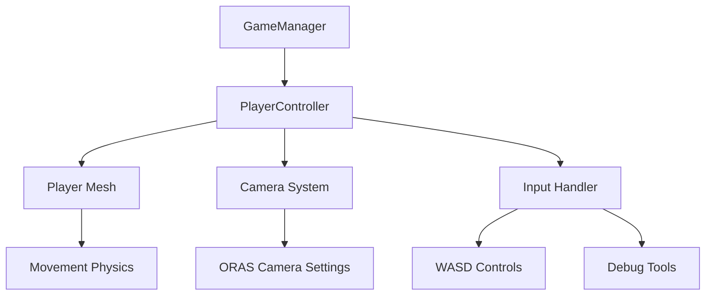
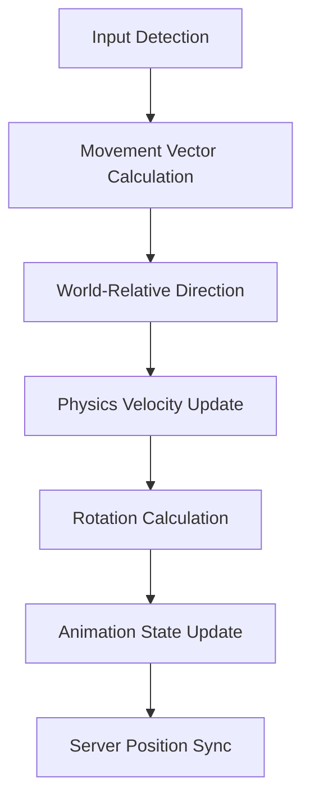
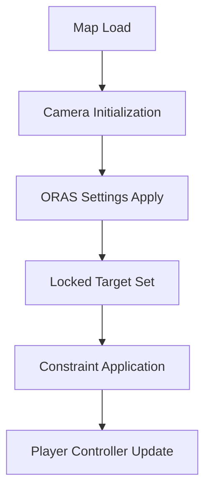

# Pokemon MMO - Camera and Orientation System Design

## Overview

This document outlines the design for fixing player orientation and camera positioning issues in the Pokemon MMO game. The system implements authentic Pokemon ORAS-style movement and camera behavior with proper world-aligned controls.

## Architecture

The solution involves modifications to two core components:
1. **PlayerController** (`public/js/player.js`) - Handles player movement and orientation
2. **GameManager** (`public/js/game.js`) - Manages camera settings and overall game state

### System Components



## Player Orientation System

### Current Issues
- Player movement is camera-relative instead of world-relative
- Player rotation calculation uses camera direction instead of world direction
- Inconsistent facing direction during movement

### Solution Design

#### World-Relative Movement
The player movement will be changed from camera-relative to world-relative to ensure consistent directional movement:

```javascript
// Current (incorrect) implementation:
const cameraForward = this.camera.getForwardRay().direction;
const cameraRight = BABYLON.Vector3.Cross(this.scene.activeCamera.upVector, cameraForward);
const forwardDir = new BABYLON.Vector3(cameraForward.x, 0, cameraForward.z).normalize();
const rightDir = new BABYLON.Vector3(cameraRight.x, 0, cameraRight.z).normalize();

// Fixed (world-relative) implementation:
// World-relative movement (Pokemon style)
if (this.inputMap.forward) {
    moveVector.z += 1; // Move north (positive Z)
}
if (this.inputMap.backward) {
    moveVector.z -= 1; // Move south (negative Z)  
}
if (this.inputMap.left) {
    moveVector.x -= 1; // Move west (negative X)
}
if (this.inputMap.right) {
    moveVector.x += 1; // Move east (positive X)
}
```

#### Player Rotation Calculation
Player rotation will be calculated based on movement direction using world coordinates:

```javascript
// Fixed rotation calculation
const targetRotation = Math.atan2(moveVector.x, moveVector.z);
```

This ensures the player always faces the direction of movement, consistent with Pokemon games.

## Camera System

### Current Issues
- Inconsistent camera settings across different maps
- Manual camera controls interfere with fixed ORAS-style view
- Camera doesn't properly follow player in all scenarios

### Solution Design

#### ORAS Camera Settings
Implement authentic Pokemon ORAS camera characteristics:

| Setting | Value | Purpose |
|---------|-------|---------|
| Radius | 8 units | Authentic ORAS distance |
| Beta | Math.PI / 3.5 | Characteristic 50-degree viewing angle |
| Alpha | -Math.PI / 2 | Behind player, facing north |
| Locked Target | Player position + 1 unit height | Proper viewing perspective |

#### Camera Constraints
Disable all manual camera controls to maintain fixed ORAS perspective:

```javascript
// Disable all camera movement for fixed ORAS view
this.camera.inertia = 0;
this.camera.angularSensibilityX = 0;
this.camera.angularSensibilityY = 0;
this.camera.panningSensibility = 0;
this.camera.wheelPrecision = 0;
this.camera.pinchPrecision = 0;
```

## Movement System Improvements

### Direction Mapping
Implement grid-aligned movement consistent with Pokemon games:

| Key | Direction | World Coordinates |
|-----|-----------|-------------------|
| W/↑ | North | +Z |
| S/↓ | South | -Z |
| A/← | West | -X |
| D/→ | East | +X |

### Smooth Rotation
Enhance rotation smoothing with proper wrap-around handling to prevent jerky movements when crossing the 0-degree boundary.

## Debug Tools

### Real-time Debug Overlay (F1)
Toggleable overlay showing:
- Player position (X, Y, Z)
- Player rotation in degrees
- Camera angles (Alpha, Beta, Radius)
- Movement state (Idle/Walking/Running)

### Movement Indicator
Visual compass showing:
- Active movement directions (green arrows)
- Player status (gold center dot, red when running)

### Console Debug (P key)
Detailed information output to console:
- Position and rotation data
- Camera settings
- Target position information

## Data Models

### Player State Model
```javascript
{
  position: { x: Number, y: Number, z: Number },
  rotation: { x: Number, y: Number, z: Number },
  isMoving: Boolean,
  isRunning: Boolean,
  currentAnimation: String // idle|walk|run
}
```

### Camera State Model
```javascript
{
  alpha: Number,     // Horizontal rotation
  beta: Number,      // Vertical angle
  radius: Number,    // Distance from target
  target: Vector3,   // Target position
  lockedTarget: Mesh // Player mesh reference
}
```

## Business Logic

### Movement Processing Flow


### Camera Update Flow


## API Endpoints

### Player Movement Update
```
POST /api/player/move
{
  "position": { "x": 0, "y": 0, "z": 0 },
  "rotation": { "x": 0, "y": 0, "z": 0 },
  "isMoving": true,
  "isRunning": false
}
```

### Camera Settings Update
```
POST /api/camera/settings
{
  "alpha": -1.5708,
  "beta": 0.8976,
  "radius": 8,
  "lockedTarget": "player"
}
```

## Testing Strategy

### Unit Tests

#### Player Orientation Tests
- Verify player faces north (0°) at start
- Confirm movement direction aligns with key pressed
- Test rotation calculation accuracy
- Validate smooth rotation transitions

#### Camera Position Tests
- Check ORAS camera settings application
- Verify camera follows player correctly
- Confirm manual controls are disabled
- Test camera behavior across map transitions

#### Movement Tests
- Validate WASD direction mapping
- Test running vs walking mechanics
- Confirm collision detection works
- Check position synchronization with server

### Integration Tests
- End-to-end movement flow
- Camera-player synchronization
- Multiplayer position updates
- Map transition handling

## Implementation Plan

### Phase 1: Player Orientation Fix
1. Modify `updateMovement()` in PlayerController to use world-relative movement
2. Update player rotation calculation to use `Math.atan2(moveVector.x, moveVector.z)`
3. Test movement direction consistency

### Phase 2: Camera System Overhaul
1. Apply ORAS camera settings in GameManager
2. Disable manual camera controls
3. Set locked target to player
4. Verify camera follows player correctly

### Phase 3: Debug Tool Integration
1. Implement F1 debug overlay
2. Add movement indicator compass
3. Create P key console debug output
4. Test all debug features

### Phase 4: Testing and Validation
1. Run unit tests for all components
2. Perform integration testing
3. Validate with different maps
4. Test multiplayer synchronization

## Expected Results

After implementation, the system will provide:

1. **Authentic Pokemon ORAS Movement**:
   - W key: Player moves forward (north), faces north
   - S key: Player moves backward (south), faces south  
   - A key: Player moves left (west), faces west
   - D key: Player moves right (east), faces east

2. **Consistent Camera Behavior**:
   - Camera always follows behind player at correct ORAS distance
   - Fixed 50-degree viewing angle
   - No manual camera controls interfering

3. **Enhanced Debugging Capabilities**:
   - Real-time position/rotation monitoring
   - Visual movement direction indicator
   - Detailed console output for troubleshooting

4. **Improved Multiplayer Experience**:
   - Consistent movement across all clients
   - Accurate position synchronization
   - Proper animation state management    C --> E[Movement Physics]
    D --> F[ORAS Camera Settings]
    B --> G[Input Handler]
    G --> H[WASD Controls]
    G --> I[Debug Tools]
```

## Player Orientation System

### Current Issues
- Player movement is camera-relative instead of world-relative
- Player rotation calculation uses camera direction instead of world direction
- Inconsistent facing direction during movement

### Solution Design

#### World-Relative Movement
The player movement will be changed from camera-relative to world-relative to ensure consistent directional movement:

```javascript
// Current (incorrect) implementation:
const cameraForward = this.camera.getForwardRay().direction;
const cameraRight = BABYLON.Vector3.Cross(this.scene.activeCamera.upVector, cameraForward);
const forwardDir = new BABYLON.Vector3(cameraForward.x, 0, cameraForward.z).normalize();
const rightDir = new BABYLON.Vector3(cameraRight.x, 0, cameraRight.z).normalize();

// Fixed (world-relative) implementation:
// World-relative movement (Pokemon style)
if (this.inputMap.forward) {
    moveVector.z += 1; // Move north (positive Z)
}
if (this.inputMap.backward) {
    moveVector.z -= 1; // Move south (negative Z)  
}
if (this.inputMap.left) {
    moveVector.x -= 1; // Move west (negative X)
}
if (this.inputMap.right) {
    moveVector.x += 1; // Move east (positive X)
}
```

#### Player Rotation Calculation
Player rotation will be calculated based on movement direction using world coordinates:

```javascript
// Fixed rotation calculation
const targetRotation = Math.atan2(moveVector.x, moveVector.z);
```

This ensures the player always faces the direction of movement, consistent with Pokemon games.

## Camera System

### Current Issues
- Inconsistent camera settings across different maps
- Manual camera controls interfere with fixed ORAS-style view
- Camera doesn't properly follow player in all scenarios

### Solution Design

#### ORAS Camera Settings
Implement authentic Pokemon ORAS camera characteristics:

| Setting | Value | Purpose |
|---------|-------|---------|
| Radius | 8 units | Authentic ORAS distance |
| Beta | Math.PI / 3.5 | Characteristic 50-degree viewing angle |
| Alpha | -Math.PI / 2 | Behind player, facing north |
| Locked Target | Player position + 1 unit height | Proper viewing perspective |

#### Camera Constraints
Disable all manual camera controls to maintain fixed ORAS perspective:

```javascript
// Disable all camera movement for fixed ORAS view
this.camera.inertia = 0;
this.camera.angularSensibilityX = 0;
this.camera.angularSensibilityY = 0;
this.camera.panningSensibility = 0;
this.camera.wheelPrecision = 0;
this.camera.pinchPrecision = 0;
```

## Movement System Improvements

### Direction Mapping
Implement grid-aligned movement consistent with Pokemon games:

| Key | Direction | World Coordinates |
|-----|-----------|-------------------|
| W/↑ | North | +Z |
| S/↓ | South | -Z |
| A/← | West | -X |
| D/→ | East | +X |

### Smooth Rotation
Enhance rotation smoothing with proper wrap-around handling to prevent jerky movements when crossing the 0-degree boundary.

## Debug Tools

### Real-time Debug Overlay (F1)
Toggleable overlay showing:
- Player position (X, Y, Z)
- Player rotation in degrees
- Camera angles (Alpha, Beta, Radius)
- Movement state (Idle/Walking/Running)

### Movement Indicator
Visual compass showing:
- Active movement directions (green arrows)
- Player status (gold center dot, red when running)

### Console Debug (P key)
Detailed information output to console:
- Position and rotation data
- Camera settings
- Target position information

## Data Models

### Player State Model
```javascript
{
  position: { x: Number, y: Number, z: Number },
  rotation: { x: Number, y: Number, z: Number },
  isMoving: Boolean,
  isRunning: Boolean,
  currentAnimation: String // idle|walk|run
}
```

### Camera State Model
```javascript
{
  alpha: Number,     // Horizontal rotation
  beta: Number,      // Vertical angle
  radius: Number,    // Distance from target
  target: Vector3,   // Target position
  lockedTarget: Mesh // Player mesh reference
}
```

## Business Logic

### Movement Processing Flow


### Camera Update Flow


## API Endpoints

### Player Movement Update
```
POST /api/player/move
{
  "position": { "x": 0, "y": 0, "z": 0 },
  "rotation": { "x": 0, "y": 0, "z": 0 },
  "isMoving": true,
  "isRunning": false
}
```

### Camera Settings Update
```
POST /api/camera/settings
{
  "alpha": -1.5708,
  "beta": 0.8976,
  "radius": 8,
  "lockedTarget": "player"
}
```

## Testing Strategy

### Unit Tests

#### Player Orientation Tests
- Verify player faces north (0°) at start
- Confirm movement direction aligns with key pressed
- Test rotation calculation accuracy
- Validate smooth rotation transitions

#### Camera Position Tests
- Check ORAS camera settings application
- Verify camera follows player correctly
- Confirm manual controls are disabled
- Test camera behavior across map transitions

#### Movement Tests
- Validate WASD direction mapping
- Test running vs walking mechanics
- Confirm collision detection works
- Check position synchronization with server

### Integration Tests
- End-to-end movement flow
- Camera-player synchronization
- Multiplayer position updates
- Map transition handling

## Implementation Plan

### Phase 1: Player Orientation Fix
1. Modify `updateMovement()` in PlayerController to use world-relative movement
2. Update player rotation calculation to use `Math.atan2(moveVector.x, moveVector.z)`
3. Test movement direction consistency

### Phase 2: Camera System Overhaul
1. Apply ORAS camera settings in GameManager
2. Disable manual camera controls
3. Set locked target to player
4. Verify camera follows player correctly

### Phase 3: Debug Tool Integration
1. Implement F1 debug overlay
2. Add movement indicator compass
3. Create P key console debug output
4. Test all debug features

### Phase 4: Testing and Validation
1. Run unit tests for all components
2. Perform integration testing
3. Validate with different maps
4. Test multiplayer synchronization

## Expected Results

After implementation, the system will provide:

1. **Authentic Pokemon ORAS Movement**:
   - W key: Player moves forward (north), faces north
   - S key: Player moves backward (south), faces south  
   - A key: Player moves left (west), faces west
   - D key: Player moves right (east), faces east

2. **Consistent Camera Behavior**:
   - Camera always follows behind player at correct ORAS distance
   - Fixed 50-degree viewing angle
   - No manual camera controls interfering

3. **Enhanced Debugging Capabilities**:
   - Real-time position/rotation monitoring
   - Visual movement direction indicator
   - Detailed console output for troubleshooting

4. **Improved Multiplayer Experience**:
   - Consistent movement across all clients
   - Accurate position synchronization
   - Proper animation state management


