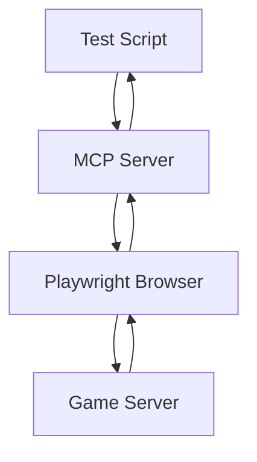

# Admin Features Testing with MCP Server and Playwright

## Overview

This document outlines how to test all admin features in the Pokemon MMO Omega Ruby Style project using the MCP (Model Context Protocol) server with Playwright automation. The system provides comprehensive administrative capabilities including user management, chat moderation, map teleportation, and access to development tools.

## System Architecture

The testing architecture consists of three main components:

1. **Main Game Server** - Runs on port 3000, hosts the game and all admin APIs
2. **MCP Server** - Runs on port 3001, provides REST endpoints for browser automation
3. **Playwright Browser** - Chromium browser instance controlled via the MCP server

### Component Interaction Flow



## Admin Features Categorization

### 1. User Management Features
- View all users
- Promote/demote users
- Ban/unban users
- Update user roles

### 2. Chat Moderation Features
- Mute/unmute users
- Warn users
- Kick users
- Clear chat
- Broadcast announcements

### 3. Map and Position Management
- Teleport users
- Summon users
- Access map editor
- Change maps

### 4. Game Object Management
- Spawn wild Pokemon
- Give/remove items
- Freeze/unfreeze players

### 5. Server Management
- View server statistics
- Shutdown server
- Set message of the day
- Reload configuration

### 6. Development Tools Access
- Map editor
- Dialogue editor
- UI editor
- Monster editor
- Admin panel

## Testing Strategy

### Authentication Flow
1. Navigate to game URL (http://localhost:3000)
2. Fill login form with admin credentials
3. Submit login form
4. Verify successful authentication

### API-Based Testing
For administrative API endpoints, use direct HTTP requests to:
- `/api/admin/users` - User management
- `/api/admin/stats` - Server statistics
- `/api/admin/chat` - Chat moderation
- `/api/admin/maps` - Map management

### UI-Based Testing
For features that require UI interaction, use Playwright through the MCP server to:
- Test chat commands
- Test map teleportation
- Test development tool access
- Test player movement and positioning

## Detailed Test Procedures

### 1. User Management Testing

#### View All Users
- Endpoint: GET `/api/admin/users`
- Expected: Returns list of all users with their details
- Verification: Check that response contains user data

#### Promote User
- Endpoint: PUT `/api/admin/users/:userId/role`
- Payload: `{ "role": "co-admin" }`
- Expected: User role is updated in database
- Verification: Check database and test user permissions

#### Ban User
- Endpoint: PUT `/api/admin/users/:userId/status`
- Payload: `{ "is_active": false }`
- Expected: User is banned and disconnected
- Verification: User cannot log in, appears as banned in user list

### 2. Chat Moderation Testing

#### Test Chat Commands
Using MCP server endpoints:
1. `/fill` - Enter chat command in input field
2. `/click` - Click send button
3. `/getText` - Verify system response

Available commands by role:
- **Helper**: /mute, /unmute, /warn
- **Co-Admin**: All helper commands + /kick, /clear, /promote, /teleport, /summon, /freeze, /unfreeze, /pokemon, /give, /remove
- **Admin**: All co-admin commands + /ban, /unban, /demote, /announce, /shutdown, /setmotd, /reload

### 3. Map Management Testing

#### Admin Map Selector
1. Press '1' key to open map selector
2. Verify map list is displayed
3. Select a map to teleport
4. Verify successful map change

#### Direct Map Teleportation
- Endpoint: POST with socket event `admin_map_change`
- Payload: `{ "mapName": "matrix", "spawnPosition": { "x": 0, "y": 1, "z": 0 } }`
- Expected: Admin is teleported to specified map and position

### 4. Development Tools Testing

#### Access Map Editor
1. Navigate to `/pokemon-map-editor/`
2. Verify editor loads successfully
3. Test map loading and editing features

#### Access Admin Tools
1. Navigate to `/dev-tools/dialogue-editor/`
2. Navigate to `/dev-tools/ui-editor/`
3. Navigate to `/dev-tools/monster-editor/`
4. Navigate to `/dev-tools/admin-panel/`

Each tool should be accessible only to admin/co-admin users.

## MCP Server Endpoints Reference

### Navigation and Interaction
- `POST /navigate` - Navigate to a URL
- `POST /click` - Click an element by selector
- `POST /fill` - Fill an input field
- `POST /getText` - Get text content of an element
- `POST /screenshot` - Take a screenshot
- `POST /pressKey` - Press a keyboard key
- `POST /waitForSelector` - Wait for an element to appear

### Example Usage Flow
```
// Navigate to game
await axios.post('http://localhost:3001/navigate', {
  url: 'http://localhost:3000'
});

// Fill login form
await axios.post('http://localhost:3001/fill', {
  selector: '#loginInput',
  text: 'leduc'
});

// Press Enter key
await axios.post('http://localhost:3001/pressKey', {
  key: 'Enter'
});

// Wait for game screen
await axios.post('http://localhost:3001/waitForSelector', {
  selector: '#game-screen'
});

// Test admin command
await axios.post('http://localhost:3001/fill', {
  selector: '#chatInput',
  text: '/promote testuser co-admin'
});

await axios.post('http://localhost:3001/click', {
  selector: '#chatSendButton'
});
```

## Test Scenarios

### Basic Admin Authentication
1. Navigate to game URL
2. Login with admin credentials
3. Verify admin dashboard/tools are accessible
4. Check role in user data

### Full Chat Command Testing
1. Test all helper commands
2. Test all co-admin commands
3. Test all admin-only commands
4. Verify permission restrictions work correctly

### Map Teleportation Testing
1. Open admin map selector
2. Test teleportation to each available map
3. Verify position updates correctly
4. Check other players see teleportation

### User Management Testing
1. Promote a user to co-admin
2. Verify new permissions
3. Demote user back to regular user
4. Test ban/unban functionality

### Development Tools Testing
1. Access each development tool
2. Verify tools load correctly
3. Test basic functionality of each tool
4. Verify tools are not accessible to non-admin users

## Expected Results

### Success Criteria
- All admin API endpoints return correct responses
- All chat commands execute successfully with proper permissions
- Map teleportation works without errors
- Development tools are accessible to admins only
- User management functions update database correctly
- Server management commands execute properly

### Error Conditions
- Non-admin users cannot access admin features
- Invalid commands return appropriate error messages
- Insufficient permissions are properly rejected
- Database errors are handled gracefully

## Implementation Considerations

### Test Data Preparation
- Ensure test users exist with different roles
- Prepare test maps and game objects
- Set up proper database state for testing

### Environment Setup
- Start main game server on port 3000
- Start MCP server on port 3001
- Ensure all required assets are available
- Verify database connection

### Test Execution Order
1. Authentication and basic access tests
2. API-based user management tests
3. UI-based chat command tests
4. Map teleportation tests
5. Development tool access tests
6. Edge case and error condition tests

## Conclusion

This testing approach using the MCP server with Playwright provides comprehensive coverage of all admin features in the Pokemon MMO. By combining direct API testing with UI automation, we can ensure that all administrative functionalities work correctly and securely.
